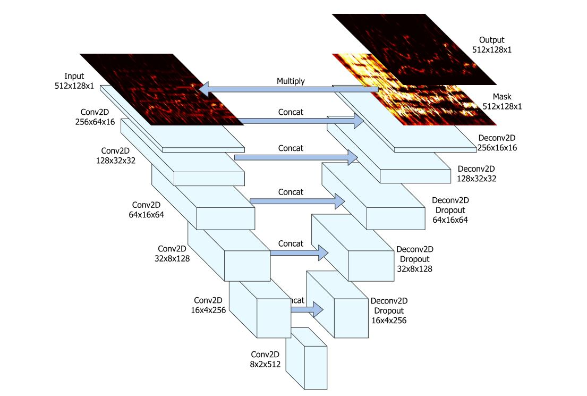

# Spleeter  - Pytorch Implementation

This repository houses a from-scratch pytorch implementation of `Spleeter` - for details see the [original repo](https://github.com/deezer/spleeter), and [paper](https://archives.ismir.net/ismir2019/latebreaking/000036.pdf).

The goal of the network is to predict the vocal and instrumental components of an input song provided as an audio spectrogram. Each stem is extracted by a separate UNet architecture similar to a convolutional autoencoder using strided convolutions and extra skip-connections.



### Run in Windows (CLI)
```sh

$ python -m venv myenv
$ \myenv\Scripts\Activate.bat
$ pip install -r requirements.txt
$ python run.py --help # Get All Commands
$ python run.py split --input=input\1.mp3 --model-path=models\2stems\model.pt --output-dir=output --offset=8 --duration=80 --write-src

# Parameters:
#     model_path: str = "models/2stems/model.pt",
#     input: str = "input/audio_example.mp3",
#     output_dir: str = "output",
#     offset: float = 0, (second)
#     duration: float = 30, (second)
#     write_src: bool = False, (write original offset of music)
#     cpu: bool = False, (using cpu)

$ python run.py test
$ python run.py model-summary
```

### Run as Backend web service (Fastapi)
```sh
# installation
$ python -m venv myenv
$ \myenv\Scripts\Activate.bat
$ pip install -r requirements.txt

# running
$ uvicorn web.main:app --reload --host=0.0.0.0 --port=8000
# localhost:8000/test_model
# localhost:8000/output
# localhost:8000/splitmp3/{item_file}
```

## TODOS:
- [X] save models output as mp3 format (without ffmpeg)
- [X] web mp3 player and redirect to music player (streaming)
    - [ ] web mp3 player play both vocal and mp3 same time for switching mode
    - [ ] slider for seek mp3
- [ ] uploader form
- [ ] api route with parameters for using in the app
- [ ] public folder for serving assets and css and etc...


```txt
1.mp3 duration:     3:33:00
      full split    00:13.7051:00
      split 30sec   00:3.0017:00
```